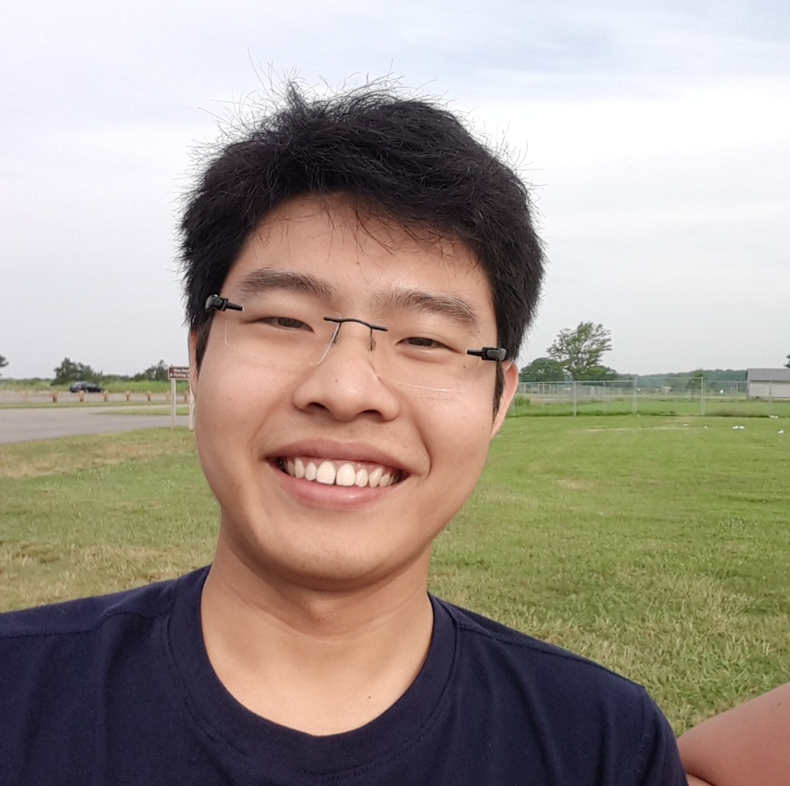

# Hi! I'm Tri (like a tree) 👋 

I enjoy building fullstack application and focus particularly on the JavaScript MERN stack (MongoDB, Express, React, Node.) 
In addition, I have experience in design patterns and working with MVC enterprise framework like ASP.Net Core.

  

## Self-taught Project: Restaurant App (MERN stack and Google Firestore Serverless Technology) :love_you_gesture::love_you_gesture:

[CodeSandbox for Live code](https://codesandbox.io/s/restaurant-frontend-77hgs) 

My proudest project is a restaurant application where I had to do everything myself, from ideation to implementation. This application is the culmination of my self-taught journey in learning JavaScript fullstack ecosystem. It reflects my learning milestones. As I progress on the learning path, I have supplanted Redux with Context API, migrating class component to functional component using hooks. Most recently, I have detached from the backend to connect to Google Firestore to store and retrieve data.

## Software Engineering Project working with real-world client (ASP.NET CORE) :dancers:

I have done a 2-semseter long project using ASP.Net Core to build a student assessment software for my university. I led a team  of 4 to develop the foundational codebase for the system. Coming into the project, I'd never worked with .NET Core, so it was a steep learning experience but also a rewarding one. 

Aside from teaching myself ASP.NET Core, the MVC pattern and MySQL afterclass, I had a chance to work in an AGILE fashion with my team and collaborate directly with a real-world client. The project not only taught me solid ASP.Net Core but I also learned to be a better team player.

## Software Engineering Project focusing on Design Patterns (Java) :hotsprings:

[UML class design](https://lucid.app/lucidchart/invitations/accept/84977170-9a9d-4918-9ddd-b2a754cbd462)

This project is where I really had a chance to flex these design pattern skills. Through the Tower Defense game created by Java Swing library, I employed multiple classic "Gang of Four" design patterns to build scalable and maintainable application. Furthermore, I applied many object-oriented principles like encapsulation, abstraction, well-behaved class and organizing code into semantic packages to further streamline the maintainability. 

Again, I had a chance to collaborate with 3 other wonderful classmates. We went from pair programming to "mob" programming and learn how to function as a team member. Without them, this project wouldn't have finished.

### Contact me via [LinkedIn](https://www.linkedin.com/in/tri97nguyen/):speech_balloon:
### Read my [resume](https://myccsu-my.sharepoint.com/:w:/g/personal/trungminhtri_nguyen_my_ccsu_edu/EcBChPiDZR1HnlYW1ap-VWUBXyuqwTG8cSCtRx2T-YfOKQ?e=Fe6gsB):roll_of_paper:

<!--
**tri97nguyen/tri97nguyen** is a ✨ _special_ ✨ repository because its `README.md` (this file) appears on your GitHub profile.

Here are some ideas to get you started:

- 🔭 I’m currently working on ...
- 🌱 I’m currently learning ...
- 👯 I’m looking to collaborate on ...
- 🤔 I’m looking for help with ...
- 💬 Ask me about ...
- 📫 How to reach me: ...
- 😄 Pronouns: ...
- ⚡ Fun fact: ...
-->
